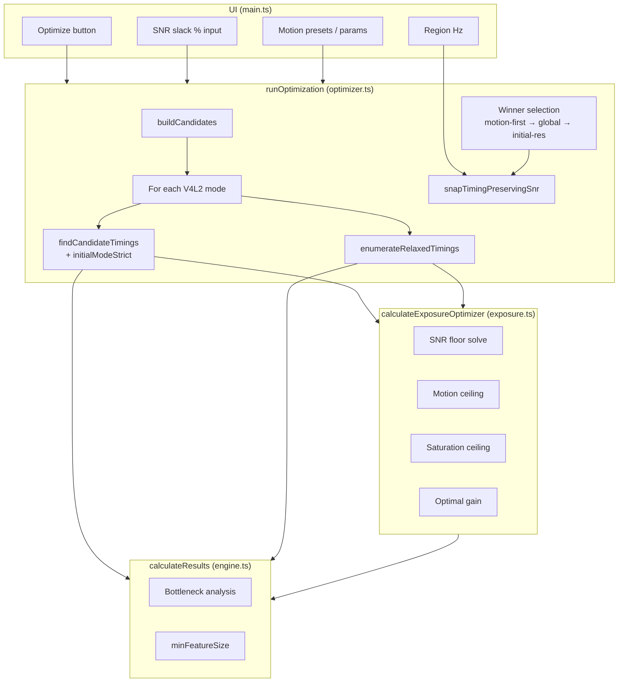
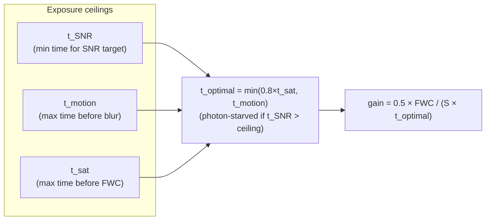
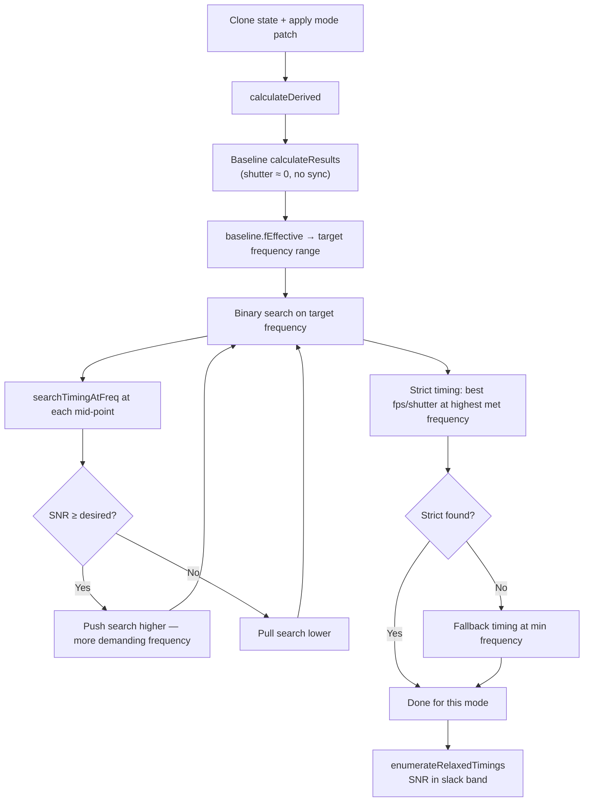
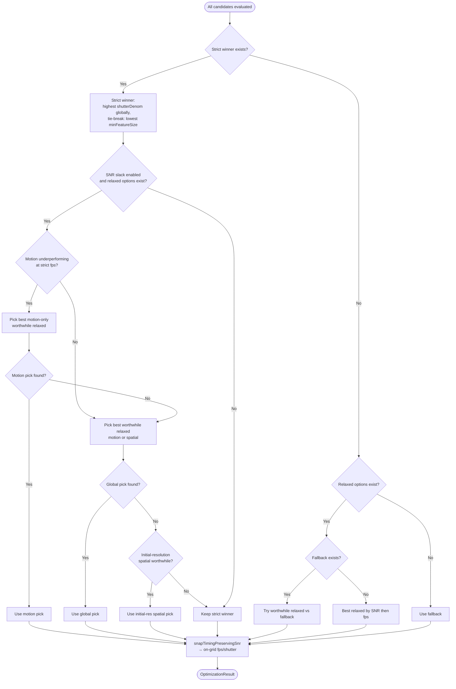
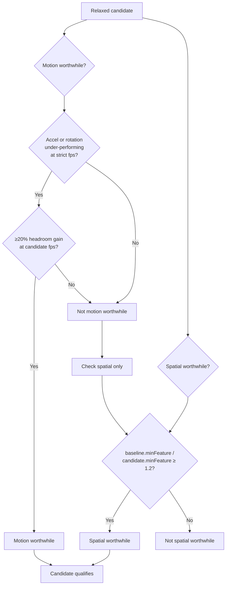

# Exposure Optimizer — How It Works

## Overview

The calculator has two related but distinct optimizers:

| Layer | Module | Trigger | What it optimizes |
|-------|--------|---------|-------------------|
| **Per-timing exposure math** | `src/exposure.ts` | Called internally on every recalculation and during one-shot search | Exposure time and gain for a *fixed* resolution, fps, and shutter — given a target spatial frequency |
| **One-shot Optimize button** | `src/optimizer.ts` | User clicks **Optimize** | Resolution (V4L2 mode), fps, and shutter across all sensor modes |

The **Optimize** button runs `runOptimization()`. That function evaluates every physically valid sensor mode, searches fps/shutter combinations on the **regional timing grid** (preset fps and shutter values only when a mains region is set), and picks the best overall configuration. Each candidate timing is scored using `calculateExposureOptimizer()` from `exposure.ts`.

**What Optimize does not touch:** compression settings (MJPEG quality, H.264 QP/bitrate), lens parameters, lux, sync error simulation, or the SNR target itself. Sync is explicitly disabled during the search (`syncEnabled = false`).

---

## User-facing controls

| Control | Default | Role |
|---------|---------|------|
| **Optimize** button | — | Runs one-shot search; writes result into fps, shutter, and resolution fields |
| **SNR slack %** | 10% | Allows SNR to fall to `desiredSnrDb × (1 − slack/100)` when a worthwhile trade exists |
| **Error budget** (Camera Sync tab) | 5 mm | Used to compute motion headroom for acceleration/rotation slack decisions |
| **Region Hz** (Quick Settings) | Auto-detected (50 or 60) | Constrains fps and shutter search to mains-frequency preset values |
| **Target distance from camera** (Spatial → Exposure Optimizer) | 3 m | Motion blur distance for exposure math, spatial results, and **Optimize** (`distanceToSubject`) |
| **Camera distance** (Camera Sync tab) | 3 m | 3D scene layout and sync Monte Carlo (`temporalDistance`) |

### Distance controls (linked vs unlinked)

Two sliders share the same range (0.5–20 m) but can store different values:

| Link mode | Target distance (Spatial) | Camera distance (Sync) |
|-----------|----------------------------|-------------------------|
| **Unlinked** | Updates exposure + Optimize only | Updates 3D/sync only |
| **Linked** | Updates both values and both UIs | Updates both values and both UIs |

Enabling link copies the current **target** distance into **camera** distance (same pattern as fps/shutter). Motion ceiling uses `vImg ∝ focalLength / distanceToSubject`; changing target distance scales allowed shutter time linearly when motion-limited.

After Optimize, fps and shutter are set as manual values — the user can tweak them freely. If no valid configuration exists, a red banner suggests increasing lux or lowering the SNR target. If a best-effort result is returned below the SNR target, a separate warning is shown.

---

## High-level architecture



---

## Part 1 — Per-timing exposure math (`calculateExposureOptimizer`)

Given a fixed app state (resolution, readout mode, scene brightness) and a **target spatial frequency** `f_target` (line pairs/mm), this function computes the exposure time and gain that maximise SNR subject to hard physical limits.

### Inputs

- Scene: `luxAtSubject`, `subjectReflectance`, `temperatureC`, `aperture`, `lensTransmission`
- Motion: linear velocity, acceleration, angular velocity, `subjectHalfWidth`, `distanceToSubject`, `focalLength`
- Sensor radiometry: QE, full-well capacity, read noise, dark current, CFA factor
- Target: `targetFEffectiveLpMm` — the spatial frequency the exposure must preserve

### The chicken-and-egg problem

Motion blur depends on shutter time, but the optimal shutter depends on how much motion blur the system can tolerate — which depends on the effective spatial frequency limit:

```
t_optimal  ←depends on←  t_motion_max
                              ↑
t_motion_max  ←depends on←  f_target (effective resolution)
                              ↑
f_effective  ←depends on←  f_temporal  ←depends on←  t_optimal
```

**Resolution:** The one-shot optimizer passes an explicit `targetFreq` from its binary search (see Part 2). When called with a fixed shutter override (during timing grid evaluation), motion ceiling is computed against that same target frequency.

### Three exposure ceilings



| Ceiling | Meaning | Formula (simplified) |
|---------|---------|-------------------|
| **SNR floor** `t_SNR` | Shortest exposure that still hits the SNR target | Quadratic solve from `SNR(t) = target` |
| **Motion** `t_motion_max` | Longest exposure before motion blur exceeds `f_target` | `0.603 / (v_img × f_target)` |
| **Saturation** `t_sat` | Time to fill the full well | `FWC / S` (electrons per second) |

The chosen exposure is:

```
t_optimal = min(0.8 × t_sat, t_motion_max)
```

If `t_SNR > t_optimal`, the scene is **photon-starved** — the SNR target is unreachable at this spatial frequency regardless of gain.

Acceleration is handled in two passes: first estimate `t_optimal` using linear velocity only, then refine `t_motion_max` using `v_eff = v + ½a×t`.

### SNR calculation

At the chosen exposure:

```
actualElectrons = S × t_optimal
totalNoise      = √(shot² + readNoise² + darkNoise²)
SNR_dB          = 20 × log₁₀(actualElectrons / totalNoise)
```

Colour subsampling formats inflate the effective SNR target (UYVY +3 dB, other compressed colour +6 dB) so the optimizer compensates automatically.

### Manual shutter override

When `manualShutterOverride` is passed (during fps/shutter grid search), the function uses that shutter time directly (capped at saturation) instead of applying the motion/SNR optimisation. This evaluates SNR at a specific user-grid timing rather than at the theoretical optimum.

---

## Part 2 — One-shot optimizer (`runOptimization`)

### Step 1 — Build candidates

Every V4L2 mode for the active sensor becomes one candidate. Each carries:

| Field | Source |
|-------|--------|
| `extractedWidth` / `extractedHeight` | Mode resolution |
| `selectedV4l2Mode` | Mode index |
| `readoutPitchMultiplier`, `readoutFullFoV`, `readoutMethod` | Mode metadata |
| `maxFps` | Mode `maxFps` |
| `maxShutterDenom` | `pixelRate / (exposure.min × hts)`, capped for rolling shutter |

If no V4L2 data exists, four resolution presets are used instead (640×480 through native).

Candidates are evaluated on a **cloned state** — live app state is not mutated until the user accepts the result.

### Step 2 — Per-candidate timing search

For each candidate:



#### Binary search on spatial frequency

The optimizer searches between `0.5%` and `100%` of the candidate's baseline `fEffective` to find the **highest spatial frequency** that still allows the SNR target to be met. Higher frequency → stricter motion ceiling → shorter allowed exposure → harder SNR problem.

At each probe frequency, `searchTimingAtFreq` evaluates all valid fps/shutter pairs.

#### Fps / shutter grid search

For a given target frequency:

1. Call `calculateExposureOptimizer` to get ideal exposure time → `idealShutterDenom`
2. Enumerate fps via `enumerateSearchFps(maxFps, regionHz)`:
   - **Regional mode** (`regionHz > 0`): only preset values from `enumerateRegionFpsValues` — e.g. 60 Hz → {30, 60, 120, …} up to `maxFps`; 50 Hz → {25, 50, 100, …}. Values like 40 fps are never considered.
   - **Free mode** (`regionHz = 0`): every integer from `maxFps` down to 1
   - Constraint: `fps ≤ idealShutterDenom`
3. For each fps, collect shutter denominators via `shuttersForFpsSearch`:
   - Continuous cap: `min(idealShutterDenom, maxShutterDenom)`
   - Regional grid values (multiples of `regionHz / 2`, `regionHz`, `2×regionHz`, …) within `[fps, cap]`
4. Score each `(fps, shutterDenom)` pair by SNR tier:

| Tier | SNR condition | Selection rule |
|------|---------------|----------------|
| **Strict** | `≥ desiredSnrDb` | Highest `shutterDenom` (shortest exposure) |
| **Relaxed** | `≥ minSnrDb` and `< desiredSnrDb` | Highest `shutterDenom` in slack band |
| **Fallback** | Below slack floor | Highest SNR |

#### Relaxed timing enumeration

When SNR slack is enabled, an `enumerateRelaxedTimings` pass runs separately for each candidate mode. It uses the same regional fps list as strict search, but evaluates a wider shutter range:

```
relaxedCap = min(maxShutterDenom, max(fps × 4, regionHz × 2))   // when regionHz > 0
relaxedCap = min(maxShutterDenom, fps × 4)                      // free mode
```

This cap lets the optimizer reach longer exposures such as 1/60 at 30 fps on a 60 Hz grid (where strict search might cap at `fps`). Only timings with `minSnrDb ≤ SNR < desiredSnrDb` are collected into the global relaxed pool.

#### Initial-resolution strict baseline

While evaluating candidates, the optimizer also records `initialModeStrict` — the strict-tier timing at the **page-load resolution** (`extractedWidth` / `extractedHeight` before Optimize), searched at `baseline.fEffective` (not at the binary-search frequency). This baseline is used exclusively for spatial slack comparisons when no motion-worthwhile relaxed pick exists, so spatial trades are measured against what the user already had at their current resolution rather than against the global strict winner (which may be a different mode or frequency).

### Step 3 — Global winner selection

After all candidates are evaluated, three pools exist:

- **Strict met** — at least one timing met the full SNR target
- **Relaxed options** — all timings in the SNR slack band, collected across all modes
- **Fallback** — best sub-threshold SNR if nothing met strict



#### Strict tier global rule

Among all strict SNR timings across every mode:

1. **Primary:** highest `shutterDenom` (shortest exposure — best motion performance)
2. **Tie-break:** lowest `minFeatureSize` (best spatial resolution at `distanceToSubject`)

This means Optimize prioritises **freezing motion** over **minimising feature size**, as long as the SNR target is met.

### Step 4 — SNR slack (worthwhile undershoot)

When a strict winner exists and SNR slack is enabled (default 10%), the optimizer compares the strict winner against all **relaxed** timings (SNR between the slack floor and the target).

A relaxed timing replaces the strict winner only if it is **worthwhile**:



| Worthwhile criterion | Condition |
|---------------------|-----------|
| **Motion** | Strict fps cannot meet acceleration *or* rotation error budget, **and** candidate fps improves that headroom by ≥20% |
| **Spatial** | Candidate `minFeatureSize` is ≥20% smaller than the relevant baseline (better resolution) |

#### Relaxed pick priority

When a strict winner exists and SNR slack is enabled, relaxed selection follows this order:

1. **Motion-first** — If acceleration or rotation is under-performing at the strict winner's fps, filter relaxed options to those with motion-worthwhile gain only (`pickBestWorthwhileRelaxed(..., motionOnly: true)`). A sports scenario where higher fps unlocks 20%+ headroom wins here even if another mode offers better spatial resolution.
2. **Global worthwhile** — If no motion-first pick, consider all relaxed options qualifying on motion *or* spatial gain against the **global strict winner's** fps and `minFeatureSize`.
3. **Initial-resolution spatial** — If still no pick, compare relaxed options at the **page-load resolution only** against `initialModeStrict` (strict timing at baseline `fEffective` on the user's current mode). Used when spatial slack at the current resolution (e.g. 1/60 @ 1920×1080) beats what strict search found elsewhere, without a motion under-performance case.

If none of the above yields a worthwhile relaxed timing, the global strict winner is kept.

Among qualifying relaxed options, `pickBestWorthwhileRelaxed` ranks by:

1. Largest absolute gain (µm for spatial, m/s² or °/s for motion)
2. Best improvement ratio
3. Lowest `minFeatureSize`
4. Highest SNR
5. Highest fps

**Important:** Spatial slack only considers timings in the **relaxed SNR band** (`minSnrDb ≤ SNR < desiredSnrDb`). A timing below the slack floor is never selected, even if spatial resolution would be much better.

Example: with a 20 dB target and 10% slack (floor = 18 dB), a 1/60 shutter at 19.8 dB with 27 mm features can replace a 1/30 shutter at 23 dB with 55 mm features — a worthwhile spatial trade.

### Step 5 — Regional timing snap

The search already evaluates only regional fps presets when `regionHz > 0`, so winners are usually on-grid. `snapTimingPreservingSnr` is a final safety pass that ensures the applied values are always valid presets:

1. If the winner is already on-grid and meets the SNR threshold → return unchanged
2. Otherwise, search all on-grid `(fps, shutterDenom)` pairs that meet the threshold and pick the **shortest exposure** (highest `shutterDenom`), preferring fps closest to the winner
3. If no on-grid pair meets SNR, **hard snap** to the nearest valid regional fps and shutter (via `snapFpsToRegion` / `snapShutterToRegion`) — the UI never receives off-grid values like 40 fps

Regional grids:

| Region | Valid fps | Valid shutter denominators |
|--------|-----------|---------------------------|
| 50 Hz | 25, 50, 100, … | 25, 50, 100, 150, … |
| 60 Hz | 30, 60, 120, … | 30, 60, 120, 180, … |
| Free (0) | Any integer 1…maxFps | Any integer ≥ fps |

The snap SNR threshold is the full target (`desiredSnrDb`) for strict winners, or the slack floor (`minSnrDb`) for relaxed winners. `snrMet` on the returned result reflects whether the **final snapped** timing meets the full target.

---

## Part 3 — What gets written back

`OptimizationResult` returned to the UI:

| Field | Applied to |
|-------|-----------|
| `fps`, `shutterDenom` | Temporal chart sliders |
| `extractedWidth`, `extractedHeight` | Sensor resolution inputs |
| `selectedV4l2Mode`, `readoutPitchMultiplier`, `readoutFullFoV`, `readoutMethod` | Internal state |
| `minFeatureSize` | Informational (from evaluation pass) |
| `snrMet` | Whether final snapped timing meets full SNR target |

---

## Key constants

| Constant | Value | Role |
|----------|-------|------|
| `DEFAULT_SNR_TARGET_DB` | 20 | Default SNR target |
| `DEFAULT_SNR_UNDERSHOOT_PCT` | 10% | Default slack allowance |
| `MOTION_UNDERSHOOT_IMPROVEMENT_PCT` | 20% | Minimum gain to justify slack trade |
| `EXPOSURE_HEADROOM_FACTOR` | 0.8 | Saturation headroom (80% of FWC) |
| `FWC_TARGET_FILL` | 0.5 | Target gain fill (50% of FWC) |
| `MOTION_MTF50_CONST` | 0.603 | Motion MTF50 constant |

---

## End-to-end dataflow (single candidate)

```
App state + mode patch
        │
        ▼
calculateDerived()          ← effective pixel pitch, skipping factor
        │
        ▼
calculateResults()          ← baseline fEffective (negligible shutter)
        │
        ▼
binarySearchTiming()        ← find highest f_target with SNR met
        │
        ├── searchTimingAtFreq() for each probe
        │         │
        │         ├── calculateExposureOptimizer(f_target)
        │         │         └── t_optimal, SNR at ideal exposure
        │         │
        │         └── for each (fps, shutter) on regional grid:
        │                   calculateExposureOptimizer(f_target, shutter)
        │                   → snrAtShutter()
        │
        ▼
calculateResults()          ← minFeatureSize at winning timing
        │
        ▼
Global comparison + SNR slack (motion-first / global / initial-res) + regional snap
        │
        ▼
OptimizationResult
```

---

## Design trade-offs and limitations

**Strict tier prefers short exposure, not best spatial resolution.** The distance chart sweeps distance on the X-axis independently of the target-distance slider. Optimize does not directly minimise chart distance resolution unless a worthwhile spatial slack trade exists.

**Regional grid constrains the search space.** With a region set, only preset fps values are evaluated — not every integer up to `maxFps`. This matches real camera drivers (e.g. 30 or 60 fps, never 40). Some SNR targets achievable with off-grid timings (e.g. fps=15) may become unreachable on-grid; the optimizer returns `null` or a best-effort fallback in those cases.

**Snap may trade SNR for grid compliance.** When no on-grid pair meets the snap threshold, the hard-snap fallback returns valid presets even if SNR falls below the threshold. `snrMet: false` is surfaced in the UI.

**Photon-starved modes are skipped** during strict evaluation but may appear in fallback if no strict timing exists anywhere.

**Compression is excluded.** A mode that meets SNR in RAW may not in MJPEG; the optimizer uses the current output format's efficiency from state but does not search over quality settings.

**Sync errors are ignored** during search. Multi-camera sync jitter is not penalised when picking fps/shutter.

---

## Source files

| File | Responsibility |
|------|---------------|
| `src/optimizer.ts` | One-shot search, SNR slack logic, candidate enumeration |
| `src/exposure.ts` | Per-timing exposure/gain/SNR math |
| `src/temporalQuantize.ts` | Regional fps/shutter grid, snap-to-grid |
| `src/engine.ts` | Bottleneck analysis, `minFeatureSize`, `fEffective` |
| `src/main.ts` | Optimize button handler, applies result to UI |
| `tests/optimizer-snr.test.ts` | SNR guarantee, slack, motion/spatial trade, regional fps tests |
| `tests/optimizer-pi-v1-default.test.ts` | Pi Cam v1 spatial slack → 1/60 @ 400 lux |
| `tests/temporal-quantize.test.ts` | Regional grid validation and snap behaviour |
